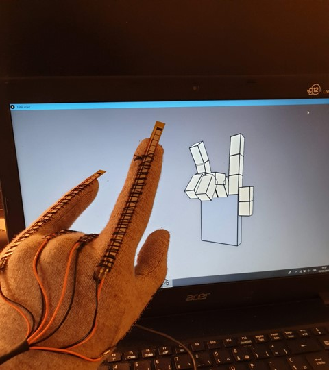
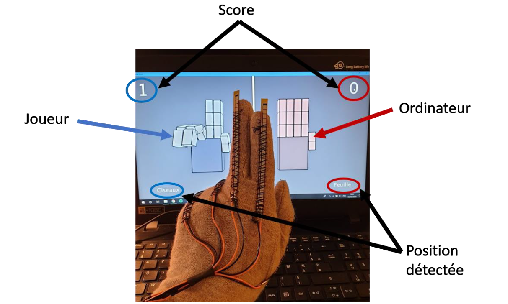

# DataGlove
Datagloves à flex sensor et transmission sans fil

# Réalisation
Il consiste à concevoir un gant intelligent, capable de transmettre la position des doigts à un PC. Ce PC doit ensuite afficher une main en 3D qui reflète la forme de la main.

# Jeu
De plus, ce projet implémente une version du jeu Pierre-Feuille-Ciseaux.

